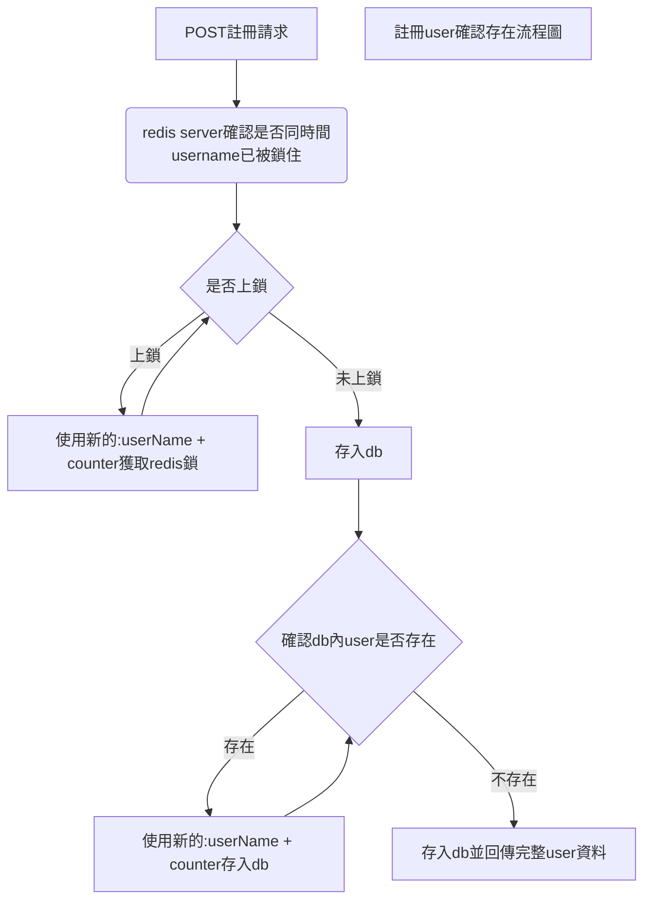

# demoForAotter
使用Docker設定所需的db連線  

    1.所需前置環境:假定主機已安裝docker  
    
    2.#安裝docker redis  
        $ docker pull  redis
      #啟動redis
        $ docker run -p 6379:6379 --name redis -d redis
    3.#安裝docker mysql
        $ docker pull mysql
    4.#在下載的customized_mysql資料夾底下執行指令，啟動customized_mysql
        $ docker run -e MYSQL_ROOT_PASSWORD=123456 -p 3306:3306 --name c_mysql -d c_mysql
    5.#安裝openjdk
        $ docker pull openjdk

將此git專案下載後，java run 此spring boot專案

```
$ java -jar target/usercenter-0.0.1-SNAPSHOT.jar
```

springboot專案已啟動並在localhost:8080連接

POST : http://localhost:8080/api/user

​	requestBody:{"userName":"tomcat"}

設計說明
